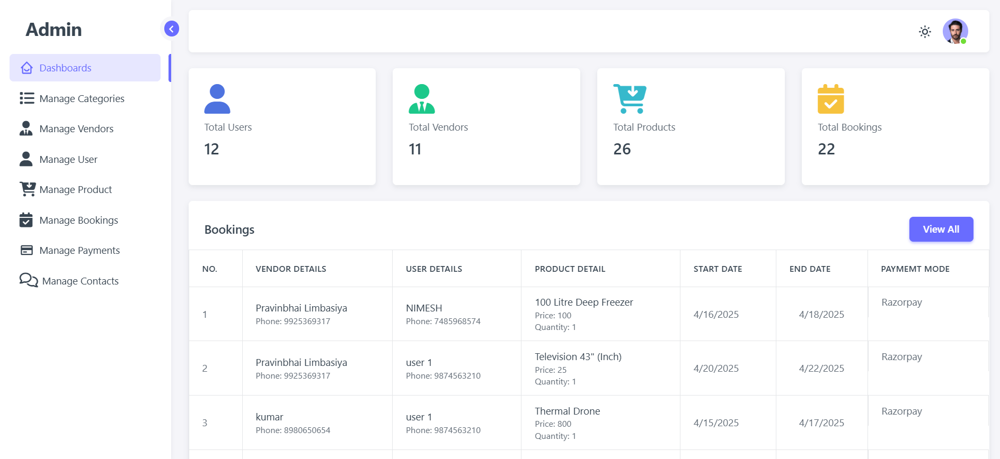
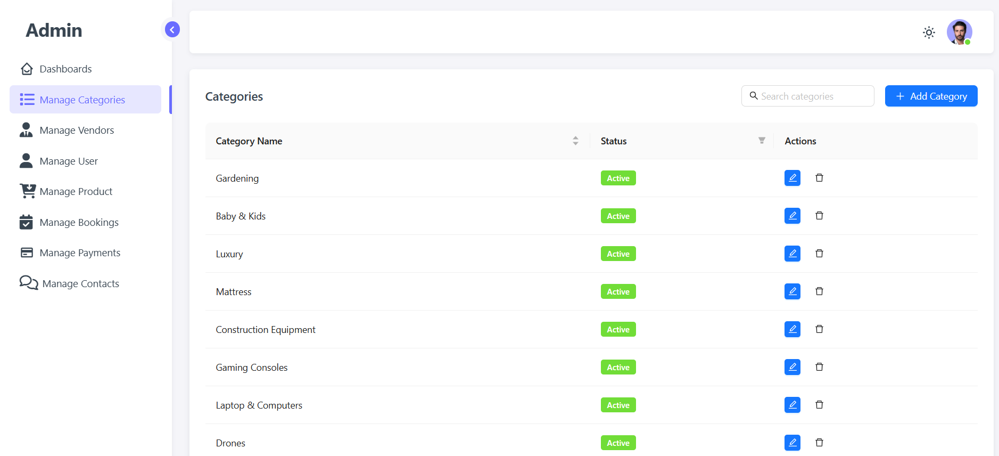
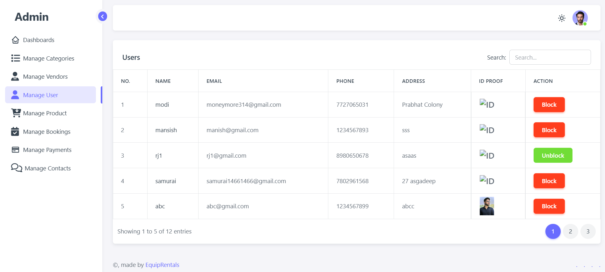
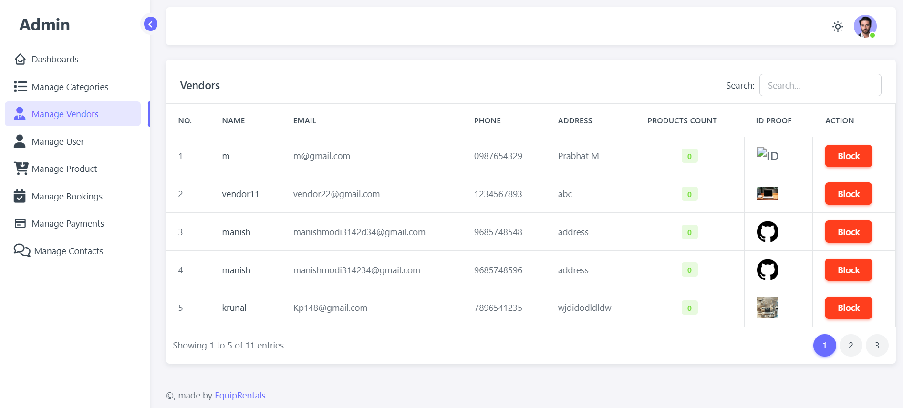
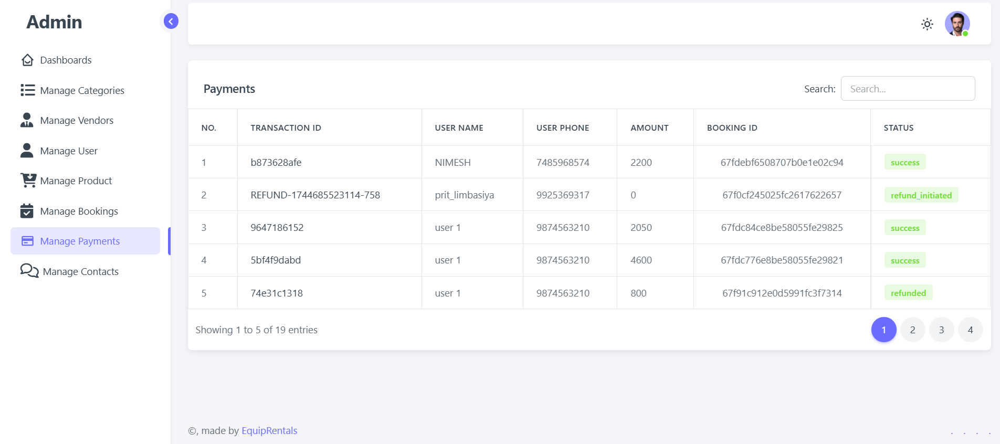
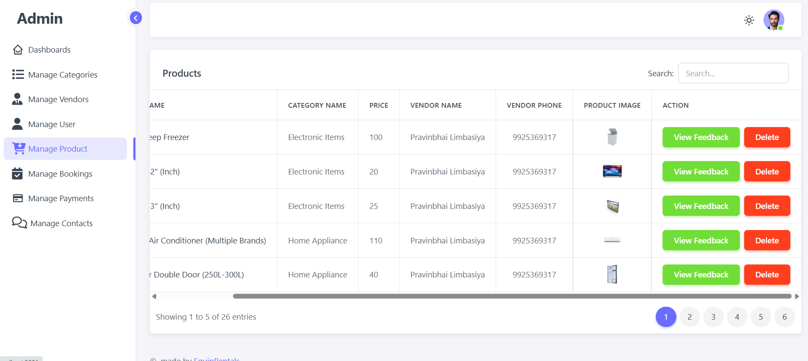

# Admin Panel – MERN App

A full‑stack **Admin Panel** built with the MERN stack (MongoDB, Express.js, React, Node.js). It lets administrators securely oversee live data for users, third‑party vendors, bookings, payments, and reviews.

---

### Home page(dark)


## ✨ Features

| Domain                                                    | Capabilities                                         |
| --------------------------------------------------------- | ---------------------------------------------------- |
| **Auth**                                                  | • JWT‑based login/logout                             |
| • Role‑based access control (admin only)                  |                                                      |
| **User Management**                                       | • View paginated user list                           |
| • Activate / deactivate an account                        |                                                      |
| **Vendor Management**                                     | • Approve, suspend, or delete vendors                |
| • See vendor profile & inventory                          |                                                      |
| **Bookings**                                              | • Real‑time list & detail view                       |
| • Change booking status (confirmed, cancelled, completed) |                                                      |
| **Payments**                                              | • Dashboard with totals & filters                    |
| • Inspect individual transactions                         |                                                      |
| **Reviews**                                               | • Moderate or remove user reviews                    |
| **Dashboard**                                             | • KPI widgets (total users, daily bookings, revenue) |
| • Time‑series charts (react‑charts)                       |                                                      |
| **Search & Filter**                                       | • Global search bar                                  |
| • Column filters, date range picker                       |                                                      |
| **Responsive UI**                                         | • Material‑UI v5 theme                               |
| • Dark / light mode toggle                                |                                                      |

---

## 🏗️ Tech Stack

* **Frontend:** React 18, React Router, Material‑UI, Axios, Recharts
* **Backend:** Node.js 20, Express 4
* **Database:** MongoDB Atlas
* **Auth:** JSON Web Tokens (JWT), bcrypt
* **State:** Redux Toolkit + RTK Query
* **Testing:**  React Testing Library, postman
* **Linting/Formatting:** ESLint (Airbnb), Prettier

---

## 🚀 Quick Start

### Prerequisites

* Node.js ≥ 18
* npm or yarn
* A MongoDB URI (local or Atlas)

### 1. Clone the repo

```bash
 git clone https://github.com/manishmodi5555/Admin-Panel-Mern-App.git
 cd admin‑panel
```

### 2. Configure env vars

Create **.env** files at the project root and at `/server`:

```dotenv
# .env (client)
VITE_API_BASE_URL=http://localhost:5000/api
# .env (server)
MONGO_URI=mongodb+srv://<user>:<pass>@cluster0.xyx.mongodb.net/app
JWT_SECRET=supersecretkey
PORT=5000
```

### 3. Install dependencies

```bash
# Root installs client deps via workspaces
npm install

# Install server deps
cd server
npm install
```

### 4. Seed sample data (optional)

```bash
npm run seed   # inside /server
```

### 5. Run the app

```bash
# Concurrently starts client (Vite) & server (nodemon)
npm run dev       # at project root
```


## 🧪 Running Tests

```bash
# Client unit & integration tests
npm run test  # inside /client

# API tests
npm run test  # inside /server
```

### Home page (light)


### Admin manage Category 


### Admin Manage Users


### Admin Manage Vendors


### Admin Manage Payment 


### Admin Manage Product  



